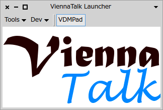

Documentation for ViennaTalk
===
ViennaTalk is a Smalltalk library to handle VDM-SL specifications.

[](http://www.youtube.com/watch?v=ZIR3fFPeTz0)
[](http://www.youtube.com/watch?v=anZoWeA5vd0)

Table of Major Components of ViennaTalk
---

* [VDMBrowser](VDMBrowser.md) - A VDM-SL browser inspired by Smalltalk's class browsers and inspectors
* [VDMPad](VDMPad.md) - A lightweight web IDE for VDM-SL with animation and diagram presentation of data
* VDMC - A Smalltalk wrapper of VDM-SL animation
* [Lively Walk-Through](LivelyWalk-Through.md) - A UI prototyping environment to animate UI prototype by VDM-SL specification
* [Webly Walk-Through](WeblyWalkThrough.md) - A Web API server to publish VDM-SL specifications of web APIs.
* ViennaEngine - Animation engine wrapper
   - ViennaVDMJ - Animation engine by local VDMJ process
   - ViennaServer - Web server to publish animation engines
   - ViennaClient - Client module of ViennaServer/VDMPad
   - ViennaBankEngine - Aggregated animation engine
* ViennaType - Smalltalk classes for VDM types
* [ViennaTalk-Values](ViennaTalk-Values.md) - Smalltalk objects for VDM values
* ViennaTalk-Parsers - VDM parsers, Smalltalk code generators and VDM source formatter.

Platform
---
ViennaTalk works on [Pharo 4.0](http://pharo.org/) .
MacOSX and Linux is supported. Windows platforms are partially supported; a local VDMJ process does not work on Widnows due to limitation of OSProcess's piping functions.

License
---
ViennaTalk is distributed under [the MIT license](https://github.com/tomooda/ViennaTalk-doc/blob/master/LICENSE).

Install
---
You may either download a pre-built package from [Release page](https://github.com/tomooda/ViennaTalk-doc/releases) or install from source code repository into [Pharo](http://pharo.org/).

Source Repository
---
The monticello repository is available at http://smalltalkhub.com/#!/~tomooda/ViennaTalk.
If you like to install from source code, please install <tt>ConfigurationOfViennaTalk</tt> and then evaluate <tt>ConfigurationOfViennaTalk load</tt>.
Or, you may at once install it by evaluating 

```
Gofer new smalltalkhubUser: 'tomooda' project: 'ViennaTalk';
    configurationOf: #ViennaTalk; load. 
(Smalltalk at: #ConfigurationOfViennaTalk) load
```

How to use
---
The ViennaTalk Launcher provides quick access.



The tools menu provies shortcuts to the tools, such as VDM Browser, Lively Walk-Through and so on.


The *ViennaTalk* menu will be available in the World menu.


Settings
---
You can open the Settings dialog from either Tools>>settings... menu of ViennaLauncher or System>>Settings menu of the World menu.


Then the Settings Browser opens.


If you want to setup the font for VDM sources, you can click on the font to open a font chooser dialog.


The update button will read all available fonts in the system. You can then choose the font family and point size, and press OK.

Acknowledgement
---
Part of the ViennaTalk project is supported by Grant-in-Aid for Scientific Research (S) 24220001 from the Japan Society for the Promotion of Science.
