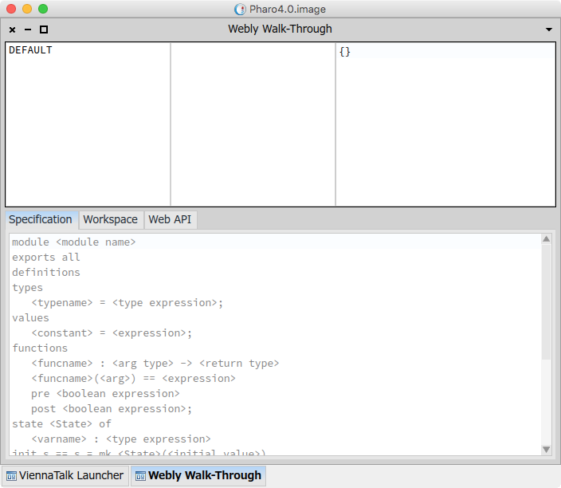
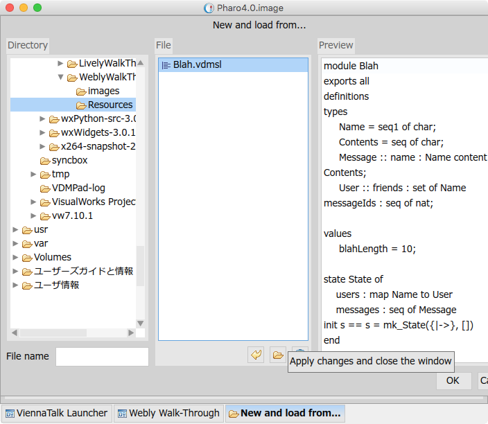
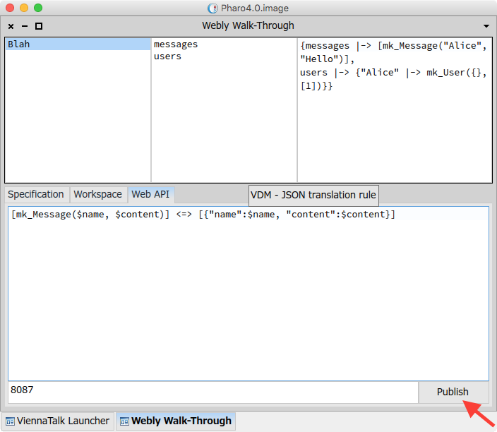
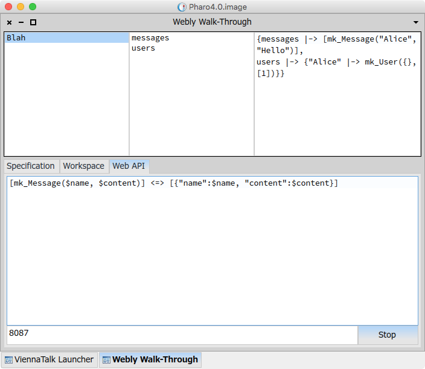
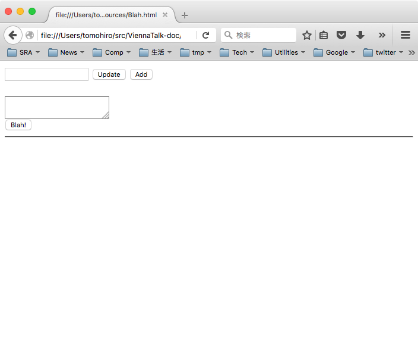
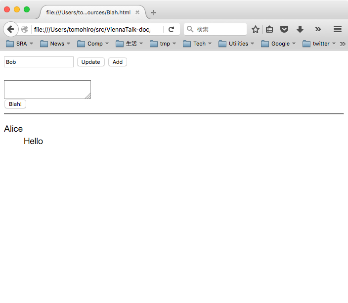
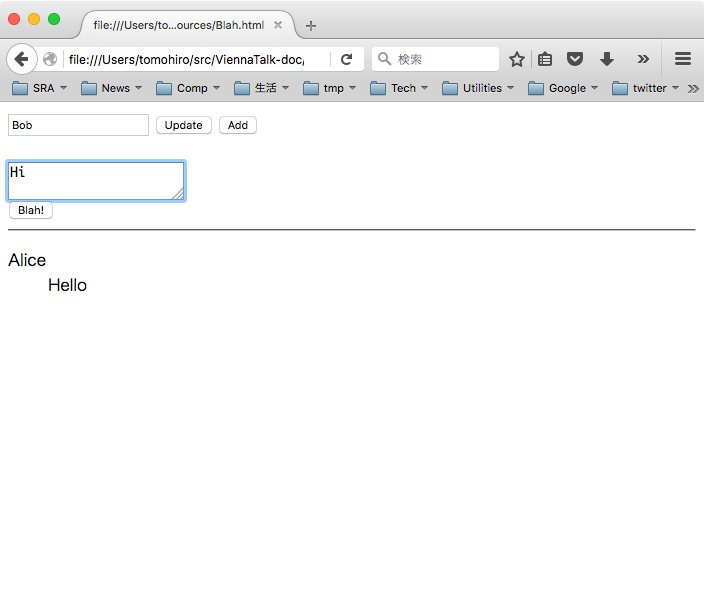
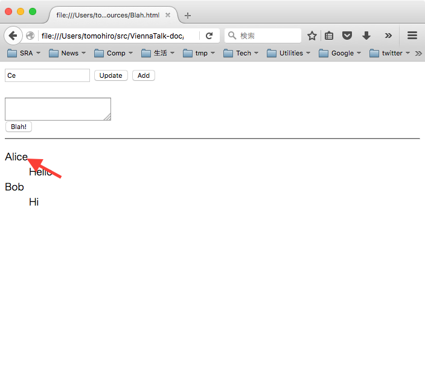
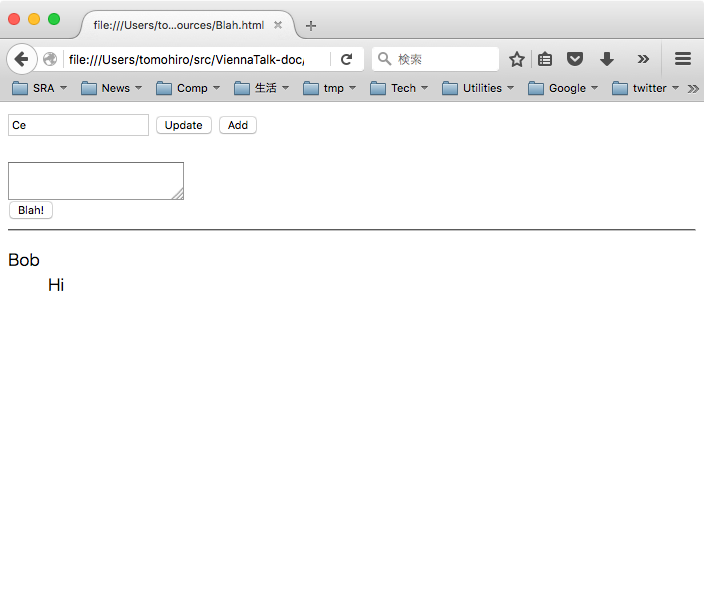

# Webly Walk-Through チュートリアル: Blahサーバ

## 目次

* [概要](#abstract)
* [準備](#preparation)
* [Webly Walk-Through を起動する](#launch-LivelyWalkThrough)
* [VDM-SL仕様を読み込む](#read-spec)
* [Workspace上でテストする](#workspace)
* [JSON-VDM 間の変換規則を定義する](#translation)
* [Web API サーバを起動する](#start)
* [ウェブブラウザで Blah API をテストする](#api-access)
* [ウェブブラウザから Blah を利用する](#client)
* [まとめ](#summary)

<a name="abstract"></a>
## 概要
このチュートリアルでは、Blah サーバという架空のウェブサービスを行うサーバのWeb API仕様を使って、Blahサーバのプロトタイプを構築することで、Webly Walk-Throughの使い方を学びます。

Blah(どうでもいい話)サーバは友人達とどうでもいい話をするためのウェブサーバです。
各ユーザは友達リストを持っていて、画面にはその友達が書き込んだBlah(どうでもいい話)が時系列で表示されます。
友達関係は非対称です。つまり、一方が他方の友達であると相手の同意なしに宣言することができ、相手は自分を友達リストに入れる必要はありません。

<a name="preparation"></a>
## 準備
### ViennaTalk
ViennaTalkを [ViennaTalk リリースページ](https://github.com/tomooda/ViennaTalk-doc/releases)から入手してください。

### チュートリアル用リソース
このチュートリアルには以下のファイルが必要です。
このチュートリアルのResourcesディレクトリから入手してください。

* Blah.vdmsl (Blah API の VDM-SL仕様)
* Blah.html (Blah のWeb画面)

<a name="launch-LivelyWalkThrough"></a>
## Webly Walk-Through を起動する
まず、ViennaTalkを起動してください。

MacならばViennaTalkアイコンをダブルクリック、Windowsならば ViennaTalk\pharo.exe、Linuxならば ViennaTalk/pharo を実行してください。


続いて、ViennaTalk Launcher の Toolsメニューから、「Webly Walk-Through」を開きます。




これで Webly Walk-Through が起動しました。
Webly Walk-Through のほとんどの機能は VDM Browser と同じです。
UI 上の違いは、ブラウザ中央の Web API タブです。
Webly Walk-Through の Web API サーバとしての機能の管理をこの Web API タブで行います。

これから Webly Walk-Through 上で Blah WebAPIサーバ プロトタイプを作成し、ウェブブラウザからアクセスしていきます。

<a name="read-spec"></a>
## VDM-SL仕様を読み込む
Blah API のVDM-SL仕様を Webly Walk-Through に読み込みます。

上段左側の「DEFAULT」と書いてあるリスト上で右クリックして、「New and load...」を選んでください。


ファイルを選択するダイアログが開くので、このチュートリアルに添付されている Resources/Blah.vdmsl を選んでください。



Blah API の VDM-SL 仕様が読み込まれました。


この仕様が定義しているAPIのうち、このAPIサーバプロトタイプでは

* getBlah : getBlah : Name ==> seq of Message
* sayBlah : Name* Contents ==> ()
* addFriend : Name* Name ==> bool
* removeFriend : Name* Name ==> bool

の4つの操作を使います。
なお、Name、Contents および Message は以下の通り定義されています。

* Name = seq1 of char
* Contents = seq of char
* Message :: name : Name content : Contents

getBlah 操作は引数で指定されたユーザの友達の書き込み最新10件を返します。

sayBlah 操作は引数で指定されたユーザとして同じく引数で指定された文字列を書き込みます。

addFriend 操作および removeFriend 操作は、引数で指定されたユーザの友達を追加および削除します。

簡単のため、いずれもユーザ認証は行いません。
未知のユーザからのアクセスに対して自動的に新規アカウントを作成します。

<a name="workspace"></a>
## Workspace上でテストする

読み込んだ Blah API の VDM-SL仕様を Webly Walk-Through ブラウザ上で動かしてみます。


ユーザ Alice が「Hello」と書き込むには、

```
sayBlah("Alice", "Hello")
```

と Workspace 上に入力して、その行を選択した状態で右クリックメニューの「Do it」を選択します。


状態変数 `messages` に `mk_Message("Alice", "Hello")` が追加されたことを確認してください。

さらに、`addFriend("Bob", "Alice")`を「Do it」し、`getBlah("Bob")`を「Print it」して、Aliceの「Hello」が得られるかテストしてみてください。

<a name="translation"></a>
## JSON-VDM 間の変換規則を定義する
`getBlah("Bob")`の返り値は`[mk_Message("Alice", "Hello")]`でした。
このVDM-SLの値の表現は Web API として標準的ではありません。
Webly Walk-Throughでは API のデータ形式として JSON を使い、VDM-SLの値をJSON形式に相互変換して Web API クライアントとデータの受け渡しをします。

Webly Walk-Throughでは 関数値を除く VDM-SL の値を自動的にJSON形式に相互変換する変換規則が標準で定義されています。
例えば `[mk_Message("Alice", "Hello")]` は、`[{"Message":["Alice","Hello"]}]` と表現されます。
この標準規則のままでもよいのですが、より使い勝手のよい Web API にするために、変換規則をユーザ定義することができます。
ここでは、`[mk_Message("Alice", "Hello")]`が `[{"content":"Hello","name":"Alice"}]`となるように変換規則を定義します。

Webly Walk-Thorugh 中央の Web APIタブをクリックしてください。
Web API タブ
Webly Walk-Thorugh 下部のテキスト領域に以下の内容を入力して、右クリックメニューの「Accept」を選んでください。

```
[mk_Message($name, $content)] <=> [{"name":$name, "content":$content}]
```

変換規則は一種のテンプレートとして定義されます。
`<=>`の左にVDM-SLの値の表現、右にJSON表現のテンプレートを記述します。
`$`が先頭についている部分が任意の値表現にマッチし、名前がつけられて`<=>`の左右で対応付けられます。

例えば `[mk_Message("Alice", "Hello")]` は $name は `"alice"` に、$content は `"Hello"` に束縛され、`[{"content":"Hello","name":"Alice"}]` に変換されます。
逆方向で、`[{"content":"Hello","name":"Alice"}]` でも $name は `"alice"` に、$content は `"Hello"` に束縛され、`[mk_Message("Alice", "Hello")]` に変換されます。

これで seq of Message 型の値に対する変換規則が定義されました。


<a name="start"></a>
## Web API サーバを起動する
Webly Walk-Through の Web API サーバを起動します。

「Web API」タブを押してください。
サーバが使用するポート番号を 最下段の入力フィールドに入力します。
デフォルトは8087で、今回はそのまま8087番ポートを使用します。

サーバを起動します。
最下段右端の「Publish」ボタンを押してください。



これで Web API サーバが起動しました。

「Publish」ボタンが「Stop」ボタンに変化しました。
これを押すと、Web API サーバが停止します。



<a name="api-access"></a>
## ウェブブラウザで Blah API をテストする

ウェブブラウザから Blah API サーバに直接アクセスします。

Firefoxブラウザを開いてください。Google Chromeでも動作します。


URLとして、`http://localhost:8087/Blah/getBlah?name="Bob"`を開いてください。


VDM-SLの値からJSONへの変換規則で指定した通りの形式でJSONデータを受け取りました。

<a name="client"></a>
## ウェブブラウザから Blah を利用する

では Blah を使ってみます。

ブラウザで、このチュートリアルに添付されている Resources/Blah.html を開いてください。



最上段にユーザ名を入力します。
今回は、「Bob」と入力してください。

Bob の友達 (Alice) の 書き込みを表示します。
「Update」ボタンを押してください。
「Update」ボタンを押さなくても10秒毎に自動的に更新します。



Bob から書き込みをしてみます。
2段目のテキスト領域に「Hi」と入力して、「Blah!」ボタンを押してください。



さらに別のユーザからの視点で Alice と Bob の書き込みを見てみます。
新規ウィンドウまたは新規タブで Resources/Blah.html を開いて、
ユーザ名として「Ce」と入力して、「Add」ボタンを押してください。

プロンプトダイアログが表示されるので、「Alice」と入力して「OK」してください。


同様に「Add」ボタンで「Bob」を友達リストに追加してください。
Alice と Bob の書き込みが時系列で表示されます。


書き込みリスト中の「Alice」をクリックすると、Alice を友達リストから削除します。



Alice の書き込みが Ce から見えなくなりました。



<a name="summary"></a>
## まとめ
このチュートリアルでは、あらかじめ用意されたVDM-SL仕様とJavaScriptを含むhtmlファイルを使って、簡単なソーシャルメッセージングシステムのプロトタイプ を構築しました。まずは VDM-SL で記述された WebAPI を VDM インタプリタを使って利用し、JSONフォーマットとの変換ルールを記述し、WebAPI サーバを立ち上げました。その Web API サーバを利用する JavaScript プログラムを含む HTML ページをウェブブラウザ上で表示することで、Web API の VDM-SL 仕様の妥当性を確認しました。

Webly Walk-Through を使って WebAPI の仕様をプロトタイプサーバ化することで、ウェブアプリケーションの開発でサーバサイドの開発中にもクライアントを動作させることができると同時にサーバサイドの開発のテストオラクルとして利用することができます。また、ウェブアプリケーションに限らず、VDM-SL 仕様のプロトタイプとしてウェブ UI を簡単に実装することができます。