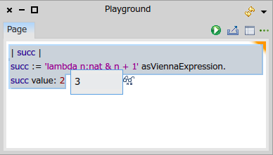
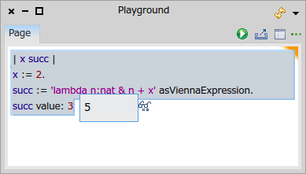
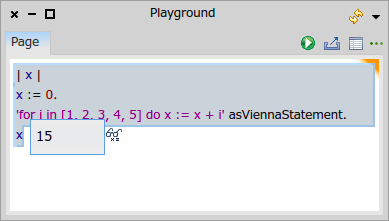
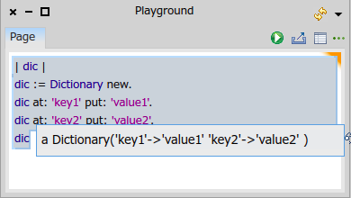
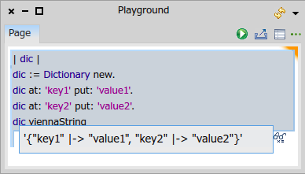
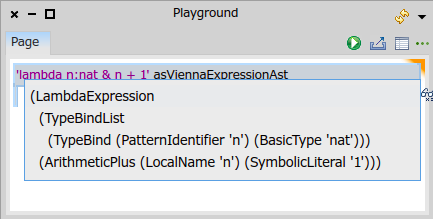

# VDM-SL in Smalltalk

[](https://www.youtube.com/watch?v=anZoWeA5vd0)

ViennaTalk defines three messages <tt>asViennaExpression</tt>, <tt>asViennaStatement</tt> and <tt>viennaString</tt> to evaluate and compose VDM expressions and/or statements om Smalltalk so that you can

1. start with a VDM specification,
2. implement a small fraction of it in Smalltalk,
3. gradually increase Smalltalk code that still contains some pieces of VDM expressions and/or statements, and then
4. finally you have a full implementation in Smalltalk

ViennaTalk also provides the <tt>asViennaExpressionAst</tt> and <tt>asViennaStatementAst</tt> messages to generate a VDM-SL's abstract syntax tree (AST).

# VDM Expressions in Smalltalk

A VDM expression in a String object can be evaluated by sending the <tt>asViennaExpression</tt> message.

```
| succ |
succ := 'lambda n:nat & n + 1' asViennaExpression.
succ value: 2
```

In the code above, the first line declares the variable <tt>succ</tt>.
In the second line, the <tt>asViennaExpression</tt> message is sent to the string object <tt>'lambda n:nat & n + 1'</tt>.
By sending the message, its content VDM expression is translated into a Smalltalk code and evaluated in the program context.
The resulting object, which is in this case a closure object <tt>[:n | n + 1]</tt>, is assigned to <tt>succ</tt>.
The third line sends the <tt>value:</tt> message with actual parameter <tt>2</tt> to evaluate the closure object, resulting <tt>3</tt> (see the below screenshot).



Smalltalk variables can be referenced in VDM expressions.

```
| x succ |
x := 2.
succ := 'lambda n:nat & n + x' asViennaExpression.
succ value: 3
```

In the third line of the above code, the VDM expression <tt>lambda n:nat & n + x</tt> references the variable <tt>x</tt>, which is declared in the first line and assigned in the second line.
The fourth line evaluates the expression with argument <tt>3</tt>, resulting <tt>5</tt> (see the below screenshot).



## VDM statements in Smalltalk

A VDM statement in a String object can be evaluated by sending the <tt>asViennaStatement</tt> message.

```
| x |
x := 0.
'for i in [1, 2, 3, 4, 5] do x := x + i' asViennaStatement.
x
```

In the code above, the string <tt>'for i in [1, 2, 3, 4, 5] do x := x + i'</tt> in the third line is translated into Smalltalk and evaluated in place.
The VDM <tt>for</tt> statement adds <tt>1</tt>, <tt>2</tt>, <tt>3</tt>, <tt>4</tt>, <tt>5</tt> to <tt>x</tt> in order.
Please note that the variable <tt>x</tt> references the Smalltalk variable declared in the first line.
The resulting value of the varibale <tt>x</tt> is <tt>15</tt> as expected.



## Smalltalk object to VDM expression

In ViennaTalk, VDM values are mapped to Smalltalk objects. Each of those objects can print a VDM expression that reproduces itself.

```
| dic |
dic := Dictionary new.
dic at: 'key1' put: 'value1'.
dic at: 'key2' put: 'value2'.
dic
```
The above piece of code creates a dictionary object that maps <tt>'key1'</tt> and <tt>'key2'</tt> to <tt>'value1'</tt> and <tt>'value2'</tt> in order (see the below screenshot).



The Smalltalk's Dictionary object are mapped to VDM's map values. In this particular example, <tt>{"key1" |-> "value1", "key2" |-> "value2"}</tt> is the counter part.
In ViennaTalk, the corresponding VDM expression can be obtained by sending the <tt>viennaString</tt> message to an object.

```
| dic |
dic := Dictionary new.
dic at: 'key1' put: 'value1'.
dic at: 'key2' put: 'value2'.
dic viennaString
```

The result is



# Generate AST
VDM expressions and statements in a String object can be parsed into ASTs by sending the <tt>asViennaExpressionAst</tt> message and the <tt>asViennaExpressionAst</tt> message in order.

For example,

```
'lambda n:nat & n + 1' asViennaExpressionAst
```

will returns its AST below.



Please note that the resulting AST is not a string object, but an instance of the <tt>ViennaNode</tt> class.
The <tt>ViennaNode</tt> class represents a simple tree node with a label and arbitrary number of children.
Tool developers can use this API to build their own tools that requires generating and manipulating ASTs.
