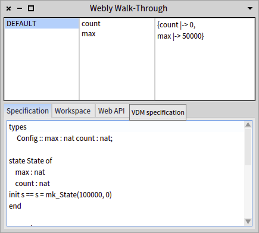
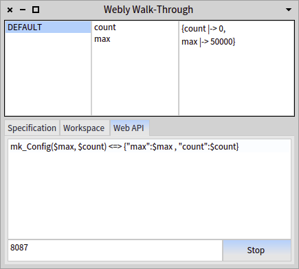
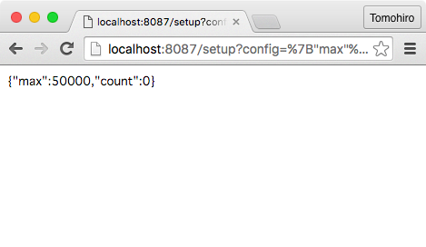

# Webly Walk-Through

Webly Walk-Through is a Web API server that publishes exported functions and operations of a VDM-SL specification.
A client program can call functions and operations through HTTP GET or POST method with parameters in JSON format.
For example, a "setCount" operation exported by the "Counter" module with an argument "0" can be requested by either

* GET /Counter/setCount?arg1=0
* POST /Counter/setCount with application/json body 0
* POST /Counter/setCount with application/x-www-form-urlencoded body "arg1=0"

With Webly Walk-Through, you can develop a specification of web service with a real client program, or develop a client program using the simulated Web API server while a real Web API server is under development.

## Webly Browser

Webly Browser is a GUI to control Webly Walk-Through.
Webly Browser is an extention to [VDM Browser](VDMBrowser.md).
This document explains only the extended part of Webly Browser.
The extensions are in the "Web API" tab of the lower pane.



### edit/load/save VDM-SL specification
Please refer to [VDM Browser's documentation](VDMBrowser.md) for how to edit a VDM specification on it.

### Write translation rules between VDM values and JSON data

The below is a screenshot of Web API tab of the Webly Browser.



The text pane is for translation rules between VDM values and JSON data.
For example, the translation rule below will translate a JSON data ```{"max": 50000, "count":0}``` into a VDM value ```mk_Config(50000, 0)``` and vice versa.

```
mk_Config($max, $count) <=> {"max":$max , "count":$count}
```

### start and stop Webly server
The push button at the bottom of the Web API tab toggles the running status of the Webly server.
The integer entry field located at left to the push button specifies port that the Webly server will listen to.

### Use Web API

The Webly server can be accessed by any programming language with HTTP requesting.
One easy way to test the API is to use a web browser.
For example, assuming that the Webly server has the specification below,

```
types
     Config :: max : nat count : nat;

state State of
    max : nat
    count : nat
init s == s = mk_State(100000, 0)
end

operations
    inc : () ==> nat
    inc() ==
        (count := count + 1;
        return count);
    
    setup : Config ==> Config
    setup(mk_Config(m, c)) ==
        (max := m;
        count := c;
        return mk_Config(max, count));
```
and the translation rule 

```
mk_Config($max, $count) <=> {"max":$max , "count":$count}
```

accessing to http://localhost:8087/setup?config=%7B%22max%22%3A50000%2C%20%22count%22%3A0%7D will call the ```setup``` operation with parameter ```mk_Config(50000, 0)``` where %7B%22max%22%3A50000%2C%20%22count%22%3A0%7D is a url quote of ```{"max": 50000, "count": 0}```.

The screenshot below shows a web broser that accesses the Webly server.


