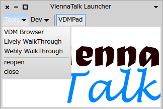
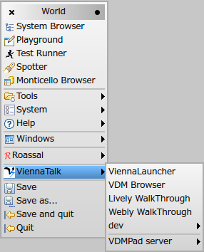
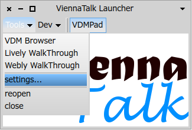
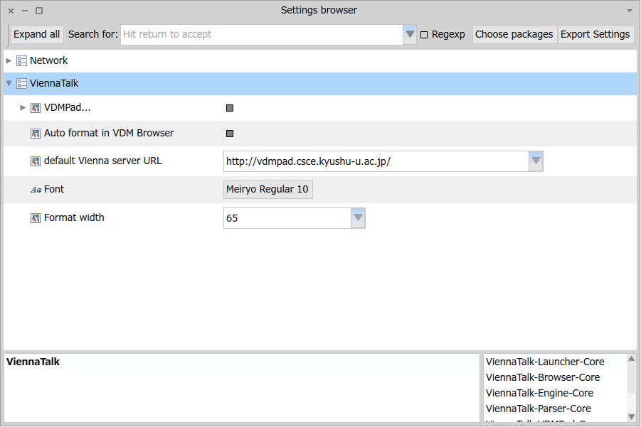
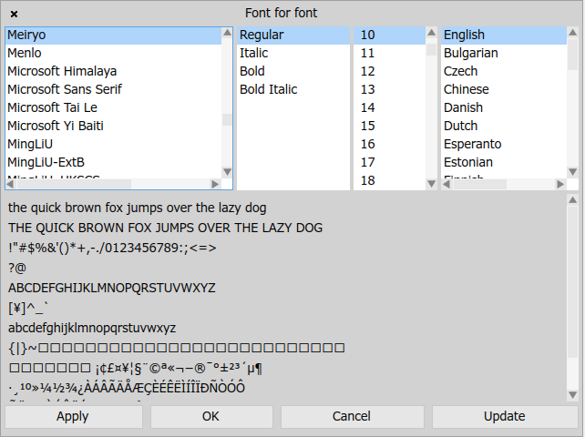
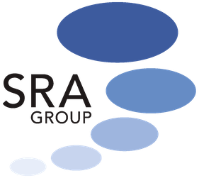

ViennaTalk ~ Live and Formal
===
ViennaTalk is a Smalltalk library to handle VDM-SL specifications.

* [The pre-built packages of the latest release](https://github.com/tomooda/ViennaTalk/releases/latest) is available.
* Try [Open VDMPad server](https://vdmpad.viennatalk.org) to experience VDM-SL. No registration/no installation is required.
* [VDM cheatsheet](https://viennatalk.org/ViennaDoc/cheatsheet-en/) provides major VDM-SL constructs with evaluatable examples. ([🇬🇧English version](https://viennatalk.org/ViennaDoc/cheatsheet-en/) [🇯🇵 Japanese version](https://viennatalk.org/ViennaDoc/cheatsheet-ja/))

Demo movies
---

Table of Major Components of ViennaTalk
---

* [VDMBrowser](VDMBrowser.md) - A VDM-SL browser inspired by Smalltalk's class browsers and inspectors
* [VDMPad](VDMPad.md) - A lightweight web IDE for VDM-SL with animation and diagram presentation of data
* ViennaAnimation - Animation manager that encapsulate execution engine
* [Lively Walk-Through](LivelyWalk-Through.md) - A UI prototyping environment to animate UI prototype by VDM-SL specification
* [Webly Walk-Through](WeblyWalkThrough.md) - A Web API server to publish VDM-SL specifications of web APIs.
* ViennaEngine - Animation engine wrapper
   - ViennaVDMJ - Animation engine by local VDMJ process
   - ViennaServer - Web server to publish animation engines
   - ViennaClient - Client module of ViennaServer/VDMPad
   - ViennaBankEngine - Aggregated animation engine
* [ViennaTalk-Types](ViennaTalk-Types.md) - Smalltalk classes for VDM types
* [ViennaTalk-Values](ViennaTalk-Values.md) - Smalltalk objects for VDM values
* [ViennaTalk-Parsers](ViennaTalk-Parser.md) - VDM parsers, Smalltalk code generators and VDM source formatter.

What's new in the latest release
---
* Codename Boulder has been released. (Dec 31, 2021)
  - Refactoring browser based on AST manipulations is now experimentally available.
  - Base Phro is upgraded to Pharo 9.

* Codename Hakodate has been released. (Sep 4, 2020)
  - ViennaVisuals: a DOM library to generate XML document and bind UI events on DOM elements to handler operations

* Codename Porto has been released. (Feb 5, 2020)
  - Base Pharo is upgraded to Pharo 8.0.
  - Better UI for Unit Testing on VDMBrowser.

* Codename Cologne has been released. (Aug 8, 2019)
  - Base Pharo is upgraded to Pharo 7.0.4.
  - JavaScript library to use ViennaServer or VDMPad to evaluate VDM-SL.
  - ViennaDoc is a documentation tool to create an animatable and testable documentation.

* Codename Lille has been released. (January 23, 2019)
  - Base Pharo is upgraded to Pharo 7.0.
  - ViennaTalk uses 64bits Virtual Machine by default (except Windows). Great thanks to the OSSubprocess team for the big improvements.
  - VDMJ bridge now works on Windows platforms using ProcessWrapper(in 32bits only).
  - Tested by CI servers by every commit. Travis is used for macOS and Linux builds and AppVeyor is used for Windows (32bits only for now).

* Codename Oxford has been released. (July 1, 2018)
  - Source repository is migrated from smalltalkhub. Great thanks to Peter Uhnak for the migration tools.
  - Base Pharo is upgraded to Pharo 6.1.
  - ViennaTalk uses 64bits Virtual Machine by default.
  - VDMJ bridge now works on 64bits VM
* Codename Harajuku has been released. (Jan 18, 2018)
  - VDM Directory Browser is a VDM browser for file-based management. The browser loads all .vdmsl files and writes into files when a spec is accepted on the specification pane.
  - ViennaUnit is a testing framework for VDM Browser. It runs all operations with the 'test' prefix in all modules with the 'Test' postfix.

* Urgent update for Maribor has been released. (Aug 30, 2017)
  - The base Pharo version is back to 5.0 due to unstability of Pharo 6.1 (32bit)

You can still manually configure ViennaTalk "Maribor" on Pharo 6.1 (64bit) with a limitation that use of VDMJ is limited only via remote site (default https://vdmpad.viennatalk.org). This limitation is from the OSSubprocess package that ViennaTalk uses to execute VDMJ process.
 
* Codename Maribor has been released. (Aug 28, 2017)
  - VDMDebugger integrated with Pharo's moldable debugger
  - migrated to Pharo 6.1 (32bit)
 
 You can debug an auto-generated Smalltalk code with its source VDM specification on Smalltalk debugger, and step-execute by granularity of the source VDM specification.

* Codename Ito has been released. (Feb 12, 2017)
  - Implicit/extended explicit functions/operations are supported by the pretty printer and code generators.
  - Exception statements (exit, always, trap and tixe statements) are supported by the pretty printer and code generators.
  
* Codename Cyprus has been updated. (Dec 20, 2016)
  - A bug in formatter is fixed.
  - A bug in Lively Walk-Through loader is fixed.
  - A bug in Livetalk compiler is fixed.
  - Code generators produce init methods that assign state variables atomically.
  
* Codename Cyprus has been released. (Nov 16, 2016)
  - Dropping a .vdmsl file will open a VDMBrowser.
  - Dropping a .lwt file will open a Lively Walk-Through window.
  - VDMC is renamed to ViennaAnimation
  - ViennaAnimation-Transpiler, which uses the code generator as an execution engine, is added.
  - Settings has Code Generator section to turn on/off runtime type checking and runtime assertion checking.
  - "use transpiler" and "use interpreter" is added to the VDMBrowser's module menu.
  - In Lively Walk-Through, the "use transpiler" option is added to the settings tab.

How to use
---
The ViennaTalk Launcher provides quick access.

The tools menu provies shortcuts to the tools, such as VDM Browser, Lively Walk-Through and so on.

The *ViennaTalk* menu will be available in the World menu.

Settings
---
You can open the Settings dialog from either Tools>>settings... menu of ViennaLauncher or System>>Settings menu of the World menu.

Then the Settings Browser opens.

If you want to setup the font for VDM sources, you can click on the font to open a font chooser dialog.

The update button will read all available fonts in the system. You can then choose the font family and point size, and press OK.

Acknowledgements
---
Part of the ViennaTalk project is supported by Grant-in-Aid for Scientific Research (S) 24220001 and Grant-in-Aid for Early-Career Scientists 18K18033 from the Japan Society for the Promotion of Science.

The ViennaTalk project is supported by [Software Research Associates, Inc.](https://www.sra.co.jp/en/).

